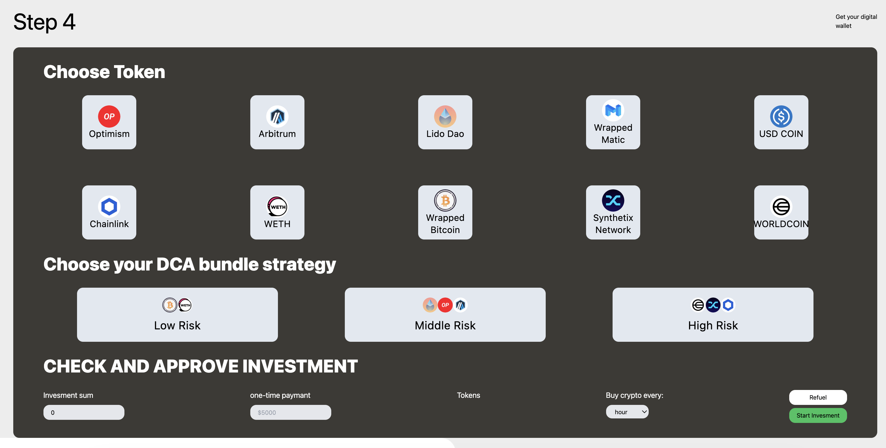
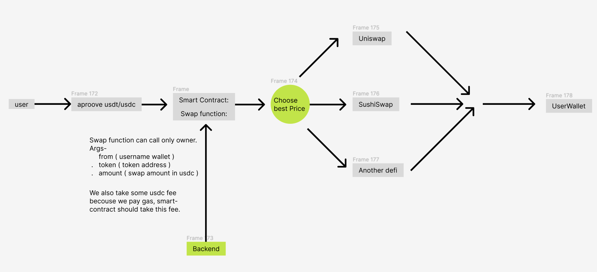
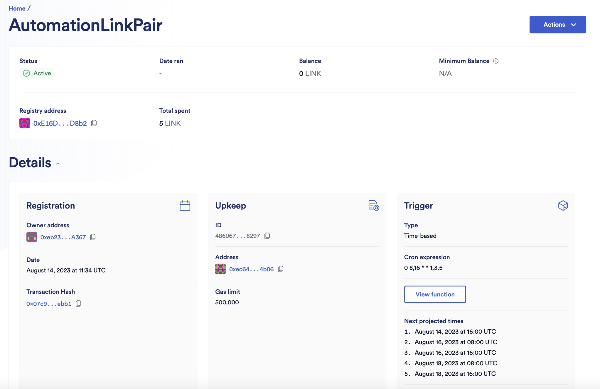
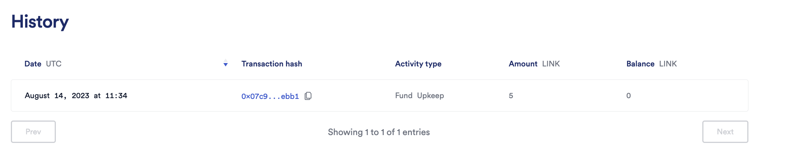

/* Deploy on Ethereum Goerli ✅ */
🦄️ Uniswap: 
1. USDC/LDO Pair Contract: 0xFEC02A3eF909835C71e55C9098d7CBA8d50C20d6
Etherscan: https://goerli.etherscan.io/address/0xFEC02A3eF909835C71e55C9098d7CBA8d50C20d6#code
2. USDC/LINK Pair Contract: 0x1fC24f7316F094aE41d5041aDeAB35Ffb424E266
Etherscan: https://goerli.etherscan.io/address/0x1fC24f7316F094aE41d5041aDeAB35Ffb424E266#code
3. USDC/SNX Pair Contract: 0xbe1Cf03E731f35A2a126f4394CFCe7c25D87E639
Etherscan: https://goerli.etherscan.io/address/0xbe1Cf03E731f35A2a126f4394CFCe7c25D87E639#code
4. USDC/WBTC Pair Contract:
Etherscan: https://goerli.etherscan.io/address/0xed3843FC4e11e378E7E18a4DAaaF8Fa897Deb859#code

/* ⚠️ Should be Deploy on Ethereum Mainnet, Testnet doesn't work ❌ */
🍣 Sushiswap: 
1. WETH/LINK Pair Contract on Goerli:
Etherscan: https://goerli.etherscan.io/address/0xF593c95176ee51b1Ae3716262221404f5F7a4a28#code

/* Deploy on Ethereum Goerli ✅ */
AutoUniswap:
1. LINK/USDC Pair Contract:
Etherscan: https://goerli.etherscan.io/address/0x377C5aee6b2F53eFF8B28d131b642b310e67cAD5#code

/* ⏰ Chainlink Automation Time set to Monday, Wednesday, Friday at 8:00 and 16:00 ⏰ */

